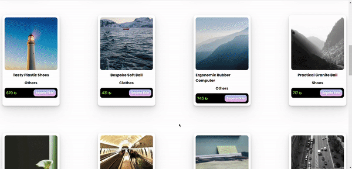

# JSECommerce

<a href="https:&#x2F;&#x2F;www.canva.com&#x2F;design&#x2F;DAFvQvxm4YI&#x2F;watch?utm_content=DAFvQvxm4YI&amp;utm_campaign=designshare&amp;utm_medium=embeds&amp;utm_source=link" target="_blank" rel="noopener">Yellow Modern Style Game Twitch Banner</a> - İSMAİL DOĞAN
